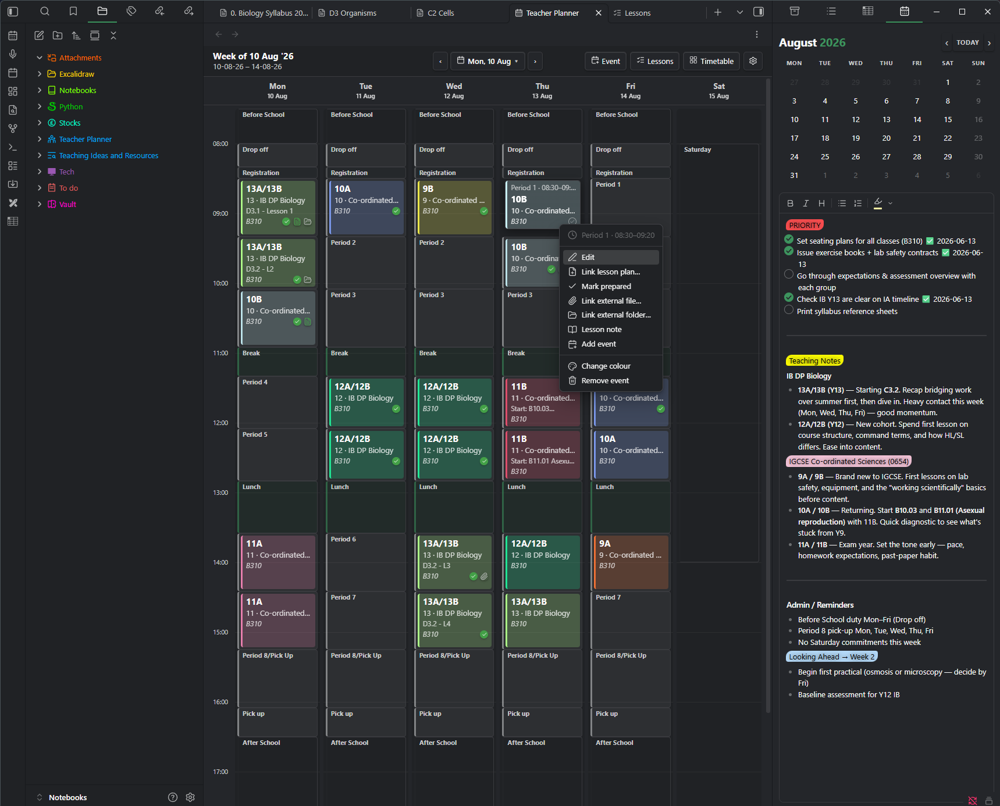
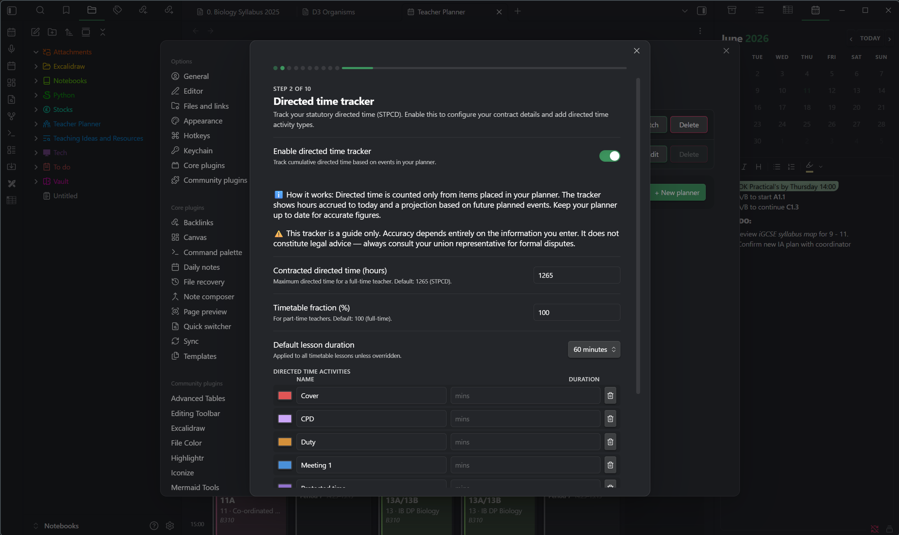
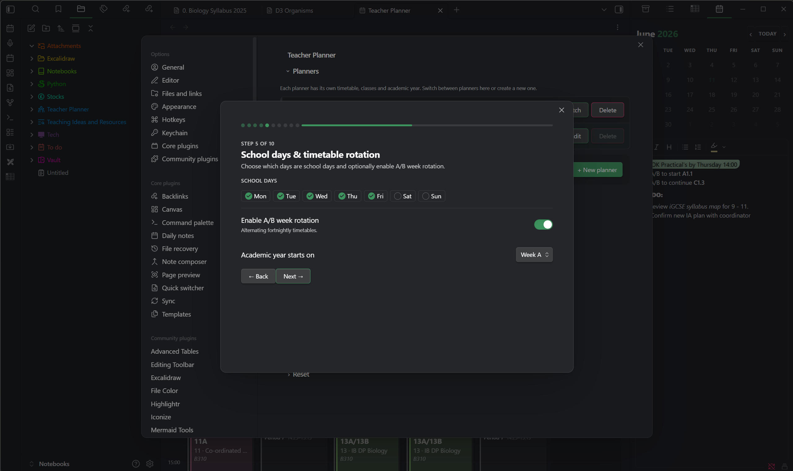
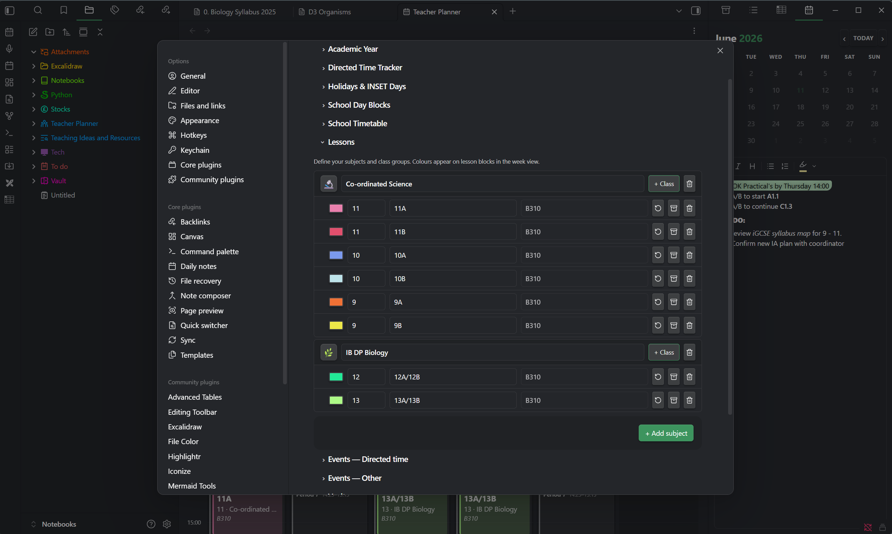

# Teacher Planner for Obsidian

> The planner built for how teachers actually work. Your timetable, your lessons, your directed time, and your notes, together in one place and never leaving your vault.



Teacher Planner turns Obsidian into a proper academic planner. It understands the things an ordinary calendar never does: periods and breaks, A and B weeks, cover and duties, directed time, and the difference between a lesson and a meeting. Everything sits alongside your notes, with no extra app to open, no subscription, and no data leaving your machine.

If you have ever kept your timetable in one place, your lesson notes in another, and your hours in a spreadsheet, this brings all three together.

## Why teachers like it

**It speaks your language.** You set up your real school day once, with your own period names, block types, and class codes, and the planner works the way your week actually runs for the rest of the year.

**It stays out of your way.** Your timetable repeats automatically, one-off changes do not disturb it, and your notes are ordinary markdown files you can search, link, and back up like anything else in your vault.

**It is yours.** The plugin is free and open source, it runs on desktop and mobile, and your planner never leaves your device.

## Build your timetable once

Lay out your week visually in the timetable editor. Define your periods and the blocks that make up a school day, whether that is a lesson, a break, registration, or anything you name yourself, then drop classes and activities into place. Each class carries its own colour, year group, code, and default room.

If your school runs a two-week timetable, turn on A and B week rotation and the planner tracks which week you are on automatically. It counts teaching weeks and skips full holiday weeks, so it never drifts out of step across a half term, and a single click on the week badge sets a one-off swap when a term starts on the opposite week.


## See your week the way you think about it

The week view is a colour-coded grid of your real teaching day. Lessons, duties, and events sit in their periods, and a single click takes you straight into a lesson note. Clear previous and next arrows move you a week at a time, and the centre button opens a date picker so you can jump to any week, or back to today, in a moment. A grid-zoom setting lets you make periods taller or more compact, and because it is kept per device your laptop and your phone can each look right.

On a phone the same planner offers a Day view for one readable day at a time, an Agenda list for the whole week, or the full grid, and it remembers which you prefer.

## Add one-off events without breaking your timetable

Real weeks are full of things that are not on the timetable: a meeting, a cover lesson, a trip, a parents' evening, a duty. Drop one onto any day and period, give it a name, a colour, a room, and a note, and you are done. An event can span several periods at once, and when it sits over free time those blocks join into one clean block so it reads as a single thing.

If you ever put two items in the same slot, the planner notices. The clash is marked on the grid, shown in red when it would affect your directed-time total, and when you add an event onto a slot that is already in use you get a clear prompt: keep both, add it without counting the overlap, or remove what was already there.

## Keep your lesson notes in your vault

Every lesson in the week view has its own note, built from a template you control and named with a filename pattern you set, using the date, period, class, subject, and even the subject emoji. Open, create, or edit a note in one click. Because the notes are plain markdown in your planner folder, they work with everything Obsidian already does, including search, backlinks, and graph view.


Link a reusable lesson-plan note to any lesson and open it straight from the chip, or attach a file or folder from anywhere on your computer. A small icon on each lesson shows what is ready at a glance, and a green tick lets you mark a lesson as prepared by hand if you would rather not link a plan note.


## Track your directed time properly

Turn on the directed-time tracker to keep a running total of your hours against the STPCD 1,265 hour limit. It counts your timetabled lessons, your directed activities, and your one-off events, projects a year-end figure, and leaves out holidays and INSET days for you. Part-time fractions are supported, and a detailed Excel report is one click away for union or management use.



## Run more than one planner, and keep it safe

Teaching across two schools, or want a clean record of last year? Run several planners in one vault, each with its own timetable, classes, and notes, and switch between them instantly. You can export any planner, or all of them, to a backup file in your vault, and import one back as a new planner. Deleting a planner saves a backup first, so it is always recoverable.

## Get your planner out

Export your timetable and planning to Excel or CSV for sharing and reporting, or export the whole thing as an iCal file and import it into Google, Apple, or Outlook calendars. Rooms, class codes, your A and B weeks, and your one-off changes all come across exactly as they appear in the week view.

## Getting started

On first launch a short setup wizard walks you through everything: your name, the academic year, your school days, periods, block types, holidays, subjects, and classes. It comes pre-filled with sensible UK defaults, so you can be up and running in minutes, and every step can be changed later in settings.



## Installation

### From the Obsidian community plugins list

1. Open Obsidian, then go to Settings, then Community plugins.
2. Click Browse and search for Teacher Planner.
3. Click Install, then Enable.

### Manual install

1. Go to the [latest release](https://github.com/NSDerred/teacher-planner-obsidian/releases/latest).
2. Download `main.js`, `manifest.json`, and `styles.css`.
3. In your vault, create the folder `.obsidian/plugins/teacher-planner/`.
4. Copy the three files into that folder.
5. Open Obsidian, then Settings, then Community plugins, and enable Teacher Planner.

Teacher Planner requires Obsidian v1.7.2 or later. Your existing planners, timetables, and notes carry over automatically when you update.

## Settings and configuration

Everything is configurable from Settings, then Teacher Planner. Two of the most-used panels:

The subjects and classes panel gives each subject an emoji and nests its class groups beneath it, each with its own colour, year group, code, and default room.



## Support

If Teacher Planner saves you time, you can buy me a coffee. It genuinely helps keep the project going.

[](https://buymeacoffee.com/teacher.nsmith)

Found a bug or have an idea? [Open an issue](https://github.com/NSDerred/teacher-planner-obsidian/issues).

## Development

<details>
<summary>For developers who want to contribute or build locally</summary>

### Prerequisites
- Node.js 18+
- npm

### Setup

```bash
git clone https://github.com/NSDerred/teacher-planner-obsidian.git
cd teacher-planner-obsidian
npm install
```

### Build

```bash
# Development (watch mode)
npm run dev

# Production build
npm run build

# Type checking
npm run typecheck
```

### Tech stack
TypeScript, Svelte 4, esbuild, and the Obsidian plugin API.

### Project structure

```
src/
├── main.ts          # Plugin entry point
├── types.ts         # Shared TypeScript types
├── settings.ts      # Default settings
├── views/           # Main views (WeekView, CalendarSidebar)
├── modals/          # All modal dialogs
├── settings/        # Settings tab
└── utils/           # Utility functions
```

</details>

## Security

Excel exports are generated with [`write-excel-file`](https://www.npmjs.com/package/write-excel-file), a write-only library. The plugin never reads or parses user-supplied Excel files, and it uses no dependency with a known security advisory.

## Licence

Teacher Planner is dual-licensed. Pick whichever option suits you:

1. [GPL-3.0](LICENSE), Copyright 2026 Nick Smith. Free to use, fork, and modify. If you distribute a modified version, the source for your version must remain available under GPL-3.0 too. This is the right choice for individuals, schools, and contributors.

2. [Commercial Licence](COMMERCIAL-LICENSE.md), for incorporating Teacher Planner into a commercial product without GPL's copyleft requirements. Contact [nicholas.f.smith@pm.me](mailto:nicholas.f.smith@pm.me) for terms.

Both options grant the right to use the plugin. The difference is in how you can distribute modifications.
